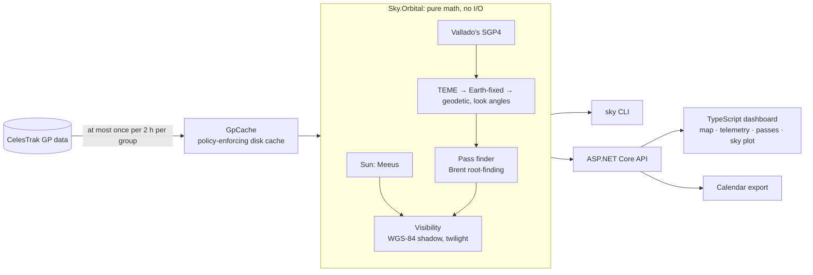

# Sky Over Phoenix

A satellite ground-station dashboard. It predicts when the International Space Station and other
satellites pass over an observer in Phoenix, Arizona (or anywhere else), and which of those passes
you can actually see from the ground. Every number it shows is checked against independent
references: published worked examples, JPL's planetary ephemeris, the U.S. Naval Observatory, and
Heavens-Above.


> **Status:** all four milestones are built and waiting for the owner's review. The suite has 400
> .NET tests, 189 unit tests for the dashboard, and 14 browser tests. All of them run offline, and CI
> runs the .NET tests on Linux, macOS, and Windows.

## What it does

- **Where a satellite is now**: position, speed, and where to look from the observer (azimuth,
  elevation, range, range rate), updated every second, with whether it is sunlit.
- **Every pass for the next 7 days**, with rise, peak, and set found to a millisecond by
  root-finding, including grazing passes that clear the horizon between samples.
- **Which passes you can see**: the satellite in sunlight while the observer's sky is dark (the
  Sun more than 6° below the horizon), and exactly when each visible stretch starts and ends, and
  why (it rises, leaves the Earth's shadow, sets, or goes into shadow).
- **Alerts**: a browser notification a few minutes before a visible pass while the dashboard is
  open, and a calendar file of visible passes with a 10-minute alarm on each (Apple Calendar and
  Outlook keep the alarm; Google Calendar uses its own reminders for imported events).
- **A command-line tool**, `sky`, that prints the same predictions.

## How it is verified

The owner's bar for this project: the math is right, with no errors and no band-aid fixes. Every
tolerance below was derived from error analysis before its test first ran, and the measured
column is the worst case over all inputs.

| What | Checked against | Worst case |
|---|---|---|
| SGP4 propagation, 666 states | Vallado's published verification set (AIAA 2006-6753) | 0.12 mm |
| The whole pipeline: position, subpoint, look angles | Skyfield, an independent Python library | 0.0008 mm, 5×10⁻¹¹° |
| Rise and set, 25 passes in a week | Skyfield events refined to a microsecond | 0.23 ms |
| The Sun's direction | JPL's DE421 ephemeris, 1950 to 2049 | 0.0092° (0.0028° in 2026) |
| Entering and leaving the Earth's shadow, 217 in a week | An independent line-ellipsoid calculation with DE421's Sun | 16 ms |
| Civil twilight at the observer | The U.S. Naval Observatory's published times | On its printed minute, all 8 |
| Visible passes | Heavens-Above, on the same element set | Rise and set within 1.1 s |

Tests are written to fail: several were checked by breaking the code on purpose and watching them
catch it. They run offline on Linux, macOS, and Windows on every push, and weekly, because each
system's math library rounds differently. Testing also turned up ten problems in the reference
sources themselves, from an overwritten error code in Vallado's C# SGP4 to a stale UT1 table in
Skyfield; each is traced and measured in [docs/verification.md](docs/verification.md).

These figures measure the implementation, not SGP4's physics: SGP4 is accurate to about a
kilometer at the element set's epoch and degrades by kilometers per day after it.

## How it works



- **Sky.Orbital** is pure functions: no network, files, or clock, so every result is reproducible.
  SGP4 is Vallado's reference code, adapted with every change listed; nothing orbital is written
  from scratch.
- **Sky.CelesTrak** keeps Sky within CelesTrak's usage policy: at most one download of each group
  per 2-hour update, never a retry after an error answer, and one request history shared by every
  process on the machine through a file lock.
- **Sky.Api** serves the dashboard and runs the same code as the CLI. The browser takes "now" from
  the server and converts times to the observer's IANA zone only for display.
- **The Docker image never contacts CelesTrak** ([ADR 0004](docs/adr/0004-offline-container.md)):
  it shows recorded data, or reads the CLI's cache read-only.

## Run it

**The dashboard, one command** (Docker):

```bash
docker compose up --build        # then open http://localhost:8080
```

This shows recorded data from 2026-09-24 on a clock started then, with no network access. For live
data, fetch it with the CLI on this machine first, then point the container at the CLI's cache:

```bash
dotnet run --project src/Sky.Cli -- passes
SKY_CACHE_DIR="$HOME/Library/Application Support/sky/celestrak" SKY_CLOCK_START= docker compose up --build
```

**The command line** ([.NET 10 SDK](https://dotnet.microsoft.com/download)):

```bash
dotnet run --project src/Sky.Cli -- now                # where the ISS is right now
dotnet run --project src/Sky.Cli -- passes --visible --count 20   # the passes you can see this week
```

**The tests:**

```bash
dotnet test --solution Sky.slnx                        # orbital math, cache policy, CLI, API
cd web && npm ci && npm test                           # dashboard unit tests
npx playwright install chromium && npm run e2e         # browser tests (in web/)
```

The browser tests start the API offline with `dotnet`, so they need the .NET SDK too (on macOS
with Homebrew, export `DOTNET_ROOT`; see `web/README.md`). On Linux, install Chromium with
`npx playwright install --with-deps chromium`.

To use your own location, copy `src/Sky.Cli/appsettings.Local.example.json` to
`appsettings.Local.json` in the same folder and edit it; the CLI and the API both read it. It is
gitignored and never goes into the Docker image; for the container, put `SKY_Observer__*`
variables in a gitignored `.env.observer` file. Time zones are IANA names such as
`America/Phoenix`.

## What was hard

- **Finding every pass.** A 10-second scan can miss a pass that clears the minimum elevation for
  under 10 seconds, or a dip below it that splits one pass into two. A bound on how fast
  elevation can change decides where to look closer, and Brent's method finds the exact moment.
- **The right Earth for the shadow.** The Earth is 21 km flatter at the poles; a spherical shadow
  gets high-latitude shadow entries seconds wrong. Stretching the ellipsoid into a sphere makes the
  exact test cheap.
- **Being a good citizen of CelesTrak.** It firewalls clients that make 50 errors in 2 hours. The
  cache records each request before sending it, stops on any error until a person looks, and
  coordinates the CLI and the API; the container never requests at all.
- **Time.** Arizona has no daylight saving time, but the code must not rely on that: times are UTC
  inside and converted with IANA zone rules only at the edge, and the tests cover the daylight
  saving changes of other zones.

## Project history

Built in four milestones, each planned, reviewed by an adversarial multi-agent review, and
documented: [the plans](docs/plans), [the decisions](docs/adr), and
[the verification record](docs/verification.md).

1. **Orbital core**: CelesTrak data, SGP4, coordinate frames, and the `sky` CLI.
2. **Pass prediction**: root-finding for rise, peak, and set, and visibility.
3. **Dashboard**: the API, the web app, and Docker.
4. **Alerts and polish**: notifications, the calendar export, and browser tests.

## Credits

- **SGP4:** D. A. Vallado, P. Crawford, R. Hujsak, and T. S. Kelso, "Revisiting Spacetrack
  Report #3," AIAA 2006-6753, 2006. Code and verification data from
  https://celestrak.org/publications/AIAA/2006-6753/. See `src/Sky.Sgp4/NOTICE.md`.
- **Orbital data:** [CelesTrak](https://celestrak.org), used within its
  [usage policy](https://celestrak.org/usage-policy.php).
- **The Sun's position:** J. Meeus, *Astronomical Algorithms*, 2nd ed., chapter 25.
- **Reference output** `tcppver.out` from [python-sgp4](https://github.com/brandon-rhodes/python-sgp4) (MIT).
- **Independent cross-checks:** [Skyfield](https://rhodesmill.org/skyfield/) (MIT) with JPL's
  DE421, the [U.S. Naval Observatory](https://aa.usno.navy.mil/data/api), and
  [Heavens-Above](https://www.heavens-above.com).
- **Map:** [Natural Earth](https://www.naturalearthdata.com) land outlines (public domain), via
  [world-atlas](https://github.com/topojson/world-atlas), drawn with [d3-geo](https://d3js.org/d3-geo).

## Why I built this

_TODO: Frankie to write._

## License

[MIT](LICENSE)
